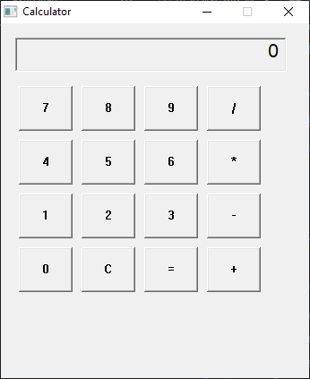

# Calculator in C

This is my **first project committed to GitHub**: a simple calculator written in **C** with a basic graphical interface.  

---

## Features

- Basic math operations:
  - ➕ Addition
  - ➖ Subtraction
  - ✖️ Multiplication
  - ➗ Division  
- **C** button to clear the input  
- **=** button to compute results  
- Simple and intuitive graphical interface with numeric buttons (0–9)  

---

## Project Preview

## Technologies Used

- **Language:** C  
- **Operating System for development:** Windows  
